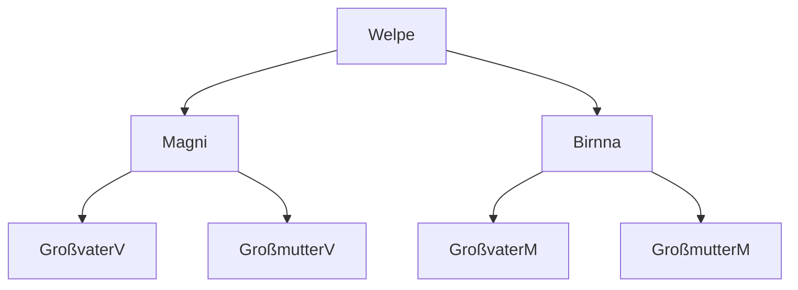

+++
date = '2025-06-29T12:37:51+02:00'
draft = true
title = 'Magni'
+++

## Stammbaum Magni × Birnna

```mermaid
graph TD
  Welpe --> Magni
  Welpe --> Birnna
  Magni --> GroßvaterV
  Magni --> GroßmutterV
  Birnna --> GroßvaterM
  Birnna --> GroßmutterM
```